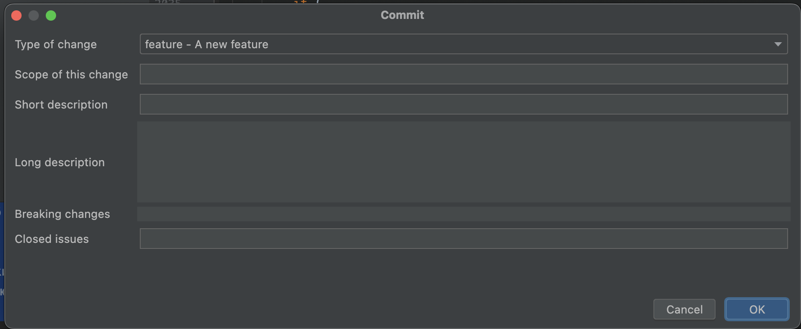
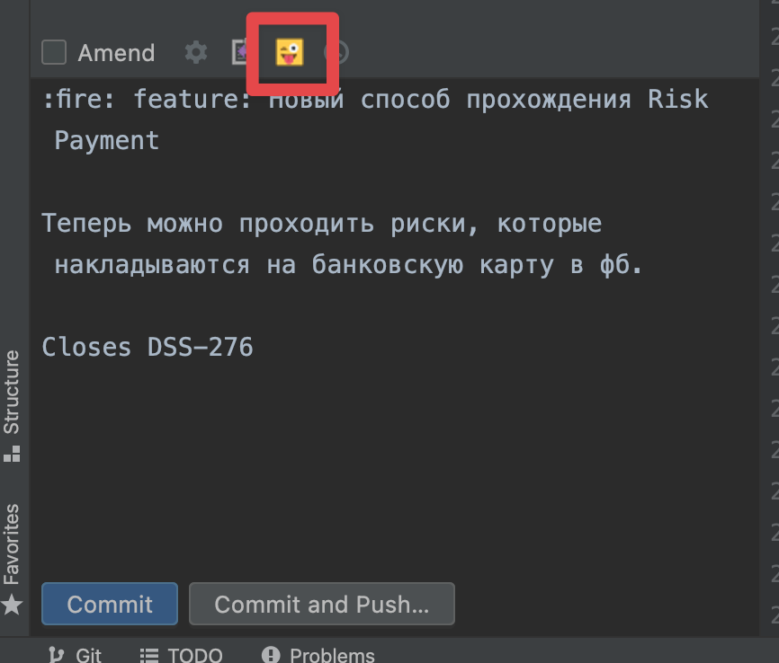

# Крутые коммиты

Я не думаю, что кто-либо станет спорить с тем, что такие коммиты - это хорошо:

## VSCode

Тут все просто. Мы просто берем [это расширение](https://marketplace.visualstudio.com/items?itemName=vivaxy.vscode-conventional-commits).

У тебя появится новая кнопка с кружочком рядом со всеми стандартными кнопками Git. Это

После ее нажатия расширение проведет тебя по нескольким вопросам:

- **Тип коммита. Обязательно.** Самые ходовые позиции - *fix, feat, docs, refactor, test*.
- **Emoji. Обязательно.** Выбери что-то логичное. Например, для фикса бага выбери жука. Если не знаешь, что лучше выбрать - выбери то, что больше всего нравится или что-то рандомное.
- **Scope.** Необязательно. Я, честно говоря, даже не знаю для чего это.
- **Короткое описание. Обязательно.** Одно предложение. Довольно часто это копипаста из заголовка тикета.
- **Подробное описание.** Необязательно. Если есть что сказать здесь - скажи.
- **ID тикета, к которому относится коммит. Обязательно.** Просто надо и все :)

## PHPStorm

Увы, в PHPStorm не обойтись одним плагином. Будем ставить два.

### Шаг 1

Устанавливаем [первый плагин](https://plugins.jetbrains.com/plugin/13477-git-commit-message-helper).

У тебя появится новая кнопка:

После ее нажатия ты попадаешь в диалог:

- **Type of change. Обязательно.** Самые ходовые позиции - *fix, feat, docs, refactor, test*.
- **Scope of this change.** Необязательно. Я, честно говоря, даже не знаю для чего это.
- **Short description. Обязательно.** Одно предложение. Довольно часто это копипаста из заголовка тикета.
- **Long description.** Необязательно. Если есть что сказать здесь - скажи.
- **Breaking changes.** Необязательно. Не заполняем.
- **Closes issues. Обязательно.** Указываешь ID тикетов.

Нажимаем кнопку `ОК`.

### Шаг 2

Устанавливаем [второй плагин](https://plugins.jetbrains.com/plugin/12383-gitmoji-plus-commit-button).

Этот плагин позволяет добавить в уже сформированное сообщение коммита emoji. После установки плагина у тебя появится новая кнопка:

Нажимай ее.

Далее следует выбрать какой-нибудь Emoji. Не особо важно, какой. Важно, чтобы он был. И делал нашу жизнь более цветной и красивой :)

В целом можно сказать, что для фиксов багов подойдет emoji жука. Для новых фичей - огонь или молния.

Если не знаешь, что выбрать, выбери любой.